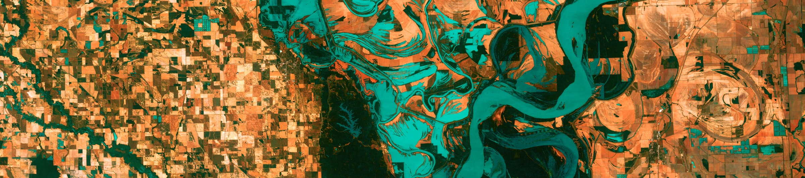

```{r setup, include=FALSE}
knitr::opts_chunk$set(echo = FALSE)

# Learn more about creating websites with Distill at:
# https://rstudio.github.io/distill/website.html

# Learn more about publishing to GitHub Pages at:
# https://rstudio.github.io/distill/publish_website.html#github-pages

```

```{r, out.width = "100%", fig.cap = "Update this image by dropping your new image into the img folder of the project, then open the index.Rmd & change the path to point to the new image. Image: Mississippi River south of Memphis, TN, from USGS shared on Unsplash (https://unsplash.com/photos/35Z2ylLRCO8)."}

# UPDATE IMAGE HERE 
# or copy/paste this code elsewhere, updating the file path, to add other images to your site!

```

## Welcome to EDS 411B

The goal of EDS 411B is to facilitate student learning, work and progress on their MEDS Capstone project through lessons, activities, supervised and unsupervised project work, and peer review and feedback. Additionally, EDS 411B provides opportunities for professional and career development (e.g. presentation skills, writing and editing, client relations, team science, panel discussions, and conflict resolution). 

Welcome!

## Weekly course schedule

-   Wednesday 1 - 4pm (NCEAS)


## Teaching team

**Instructor:** Ruth Oliver (rutholiver\@bren.ucsb.edu)

-   **Office:** Bren Hall 4512
-   **Student hours:** Friday 1-3pm PT 
-   **The best way to contact me is:** email

## Important links
-   [Sign up for appointments here](https://calendar.app.google/P2aBBdX34mT8pg7B6)

-   [Course syllabus](syllabus.pdf)

-   [Capstone Guidelines](capstone-guidelines-2023.pdf)

-   [Code of Conduct](https://www.sa.ucsb.edu/regulations/student-conduct-code/student-conduct-code)


